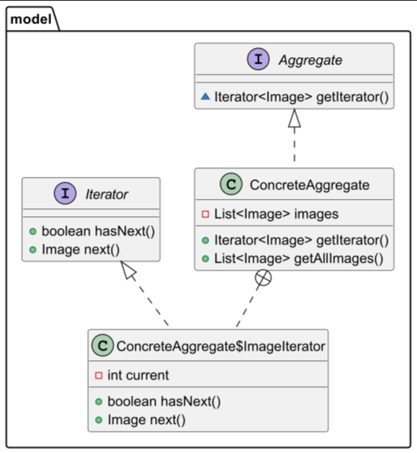

# Паттерн Итератор
Паттерн Итератор — это поведенческий паттерн проектирования, который предоставляет способ последовательного доступа ко всем элементам составного объекта (коллекции), не раскрывая его внутреннее представление. Итератор позволяет обходить элементы коллекции независимо от того, как она реализована.
